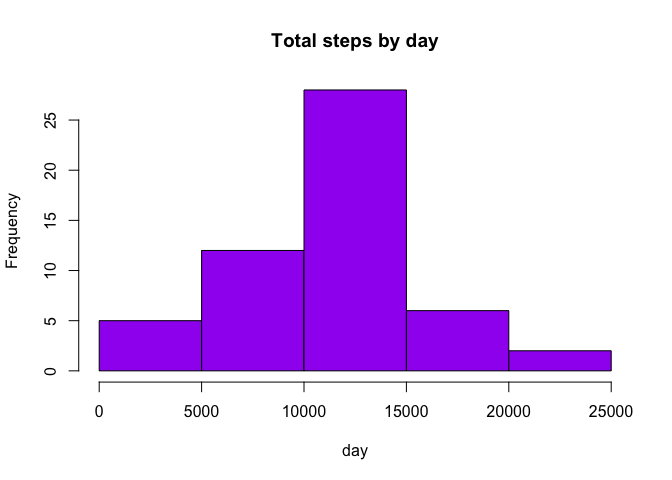
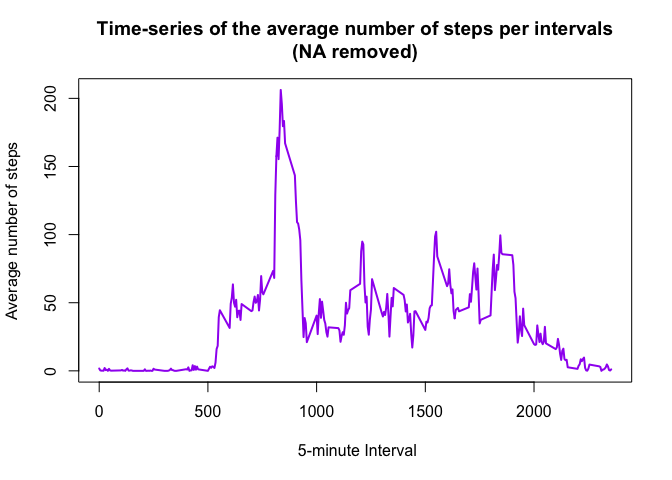
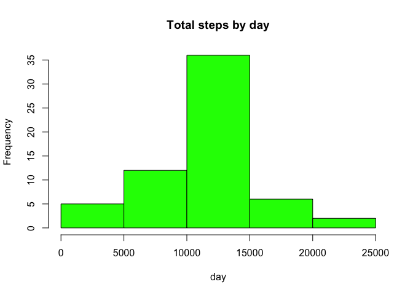
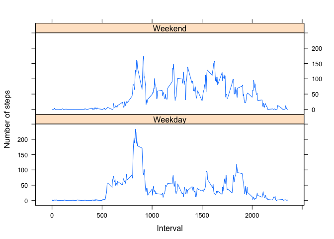

# Reproducible Research Peer Assignment 1
Vimala Venugopalan Mark  
August 5, 2015  
## Loading and preprocessing the data

1.  Loading the raw activity data into activityData

* Clear the workspace and load libraries

```r
rm(list=ls())
library(lattice)
```

```r
activityData <- read.csv("activity.csv", stringsAsFactors=FALSE)
```

2.  Processing and transform the data 


```r
activityData$date <-  as.POSIXct(activityData$date, format="%Y-%m-%d")
```

## What is mean total number of steps taken per day?
1. What is  total number of steps taken per day?

```r
stepsPerDay <- aggregate(steps ~ date, data = activityData, sum, na.rm = TRUE)
colnames(stepsPerDay) <- c("date","steps")
head(stepsPerDay)
```

```
##         date steps
## 1 2012-10-02   126
## 2 2012-10-03 11352
## 3 2012-10-04 12116
## 4 2012-10-05 13294
## 5 2012-10-06 15420
## 6 2012-10-07 11015
```

2. Histogram of total number of steps taken daily


```r
hist(stepsPerDay$steps, main = "Total steps by day", xlab = "day", col = "purple")
```

 

3. Report the mean and median of the total number of steps taken per day


```r
stepsMean <- mean(stepsPerDay$steps)
stepsMedian <- median(stepsPerDay$steps)
```


```r
print (sprintf("Mean total steps per Day: %f", stepsMean))
```

```
## [1] "Mean total steps per Day: 10766.188679"
```

```r
print (sprintf("Median total step per Day: %f", stepsMedian))               
```

```
## [1] "Median total step per Day: 10765.000000"
```

## What is the average daily activity pattern?

1. Make a time series plot (i.e type ="l") of the 5-minute interval (x-axis) and the average number of steps taken averaged across all days (y-axis)


```r
stepsPerInterval <- aggregate(activityData$steps,
                              by = list(activityData$interval),            
                              FUN=mean, na.rm=TRUE)

names(stepsPerInterval) <- c("interval","mean")

# display stepsPerInterval
head(stepsPerInterval)
```

```
##   interval      mean
## 1        0 1.7169811
## 2        5 0.3396226
## 3       10 0.1320755
## 4       15 0.1509434
## 5       20 0.0754717
## 6       25 2.0943396
```


```r
plot(stepsPerInterval$interval, 
     stepsPerInterval$mean, 
     type="l", 
     col="purple", 
     lwd=2, 
     xlab=" 5-minute Interval", 
     ylab="Average number of steps", 
     main="Time-series of the average number of steps per intervals\n(NA removed)")
```

 

2. Which 5-minute interval, on average across all the days in the dataset, contains the maximum number of steps?


```r
# finding the position of the maximum mean
max_pos <- which.max(stepsPerInterval$mean)

# Lookup the value of interval at this position
max_interval <- stepsPerInterval[max_pos, 1]

print (sprintf("Max number of steps in 5-minute interval %f", max_interval))
```

```
## [1] "Max number of steps in 5-minute interval 835.000000"
```

##Imputing missing values


1. Calculate and report the total number of missing values in the dataset 

```r
activityDataNA <- sum(is.na(activityData))
print (sprintf("Total number of missing values %f ", activityDataNA))
```

```
## [1] "Total number of missing values 2304.000000 "
```

2. Devise a strategy for filling in all of the missing values in the dataset. The strategy does not need to be sophisticated. For example, you could use the mean/median for that day, or the mean for that 5-minute interval, etc.


```r
averageSteps <- aggregate (steps ~ interval, data =activityData, FUN=mean)
fillNA <- numeric()
for (i in 1:nrow(activityData)) {
     obs <- activityData[i,]
     if (is.na(obs$steps)) {
        steps <- subset(averageSteps, interval == obs$interval)$steps
     } else {
        steps <- obs$steps
     }
     fillNA <- c(fillNA, steps)
}
```

3. Create a new dataset that is equal to the original dataset but with the missing data filled in.


```r
newActivityData <- activityData
newActivityData$steps <- fillNA
```

4. Make a histogram of the total number of steps taken each day and Calculate and report the mean and median total number of steps taken per day. Do these values differ from the estimates from the first part of the assignment? What is the impact of imputing missing data on the estimates of the total daily number of steps?


```r
stepsTotal <- aggregate(steps ~ date, data = newActivityData, sum, na.rm = TRUE)
```

5.  New Histogram using stepsTotal dataframe

```r
hist(stepsTotal$steps, main = "Total steps by day", xlab = "day", col = "green")
```

 

6. Reporting new mean and median steps per Day


```r
newStepsMean <- mean(stepsTotal$steps)
newStepsMedian <- median(stepsTotal$steps)
```


```r
print (sprintf("Mean total steps per Day: %f", newStepsMean))
```

```
## [1] "Mean total steps per Day: 10766.188679"
```

```r
print (sprintf("Median total step per Day: %f", newStepsMedian))               
```

```
## [1] "Median total step per Day: 10766.188679"
```

After imputing the missing NA values.   The mean is the same, and the median is equal to the mean.

##Are there differences in activity patterns between weekdays and weekends?

1. For this part the weekdays() function may be of some help here. Use the dataset with the filled-in missing values for this part.


```r
day <- weekdays(activityData$date)
daylevel <- vector()
for (i in 1:nrow(activityData)) {
    if (day[i] == "Saturday") {
        daylevel[i] <- "Weekend"
    } else if (day[i] == "Sunday") {
        daylevel[i] <- "Weekend"
    } else {
        daylevel[i] <- "Weekday"
    }
}
activityData$daylevel <- daylevel
activityData$daylevel <- factor(activityData$daylevel)

stepsByDay <- aggregate(steps ~ interval + daylevel, data = activityData, mean)
names(stepsByDay) <- c("interval", "daylevel", "steps")
```

2. Create a new factor variable in the dataset with two levels – “weekday” and “weekend” indicating whether a given date is a weekday or weekend day.

Make a panel plot containing a time series plot (i.e. type = "l") of the 5-minute interval (x-axis) and the average number of steps taken, averaged across all weekday days or weekend days (y-axis). 


```r
xyplot(steps ~ interval | daylevel, 
       stepsByDay, 
       type = "l", 
       layout = c(1, 2), 
       xlab = "Interval", 
       ylab = "Number of steps")
```

 
